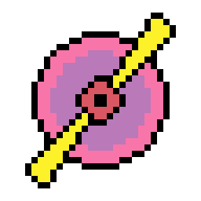

<a name="readme-top"></a>

<!-- PROJECT LOGO -->
<br />
<div align="center">
  <a href="https://github.com/duckmaniac/fly-engine">
    
  </a>

  <h3 align="center">Fly Engine</h3>

  <p align="center">
    A lightweight, user-friendly game engine for budding game developers and hobbyists.
    <br />
    <a href="https://github.com/duckmaniac/fly-engine/issues">Report Bug</a>
  </p>
</div>

<!-- TABLE OF CONTENTS -->
<details>
  <summary>Table of Contents</summary>
  <ol>
    <li>
      <a href="#about-the-project">About The Project</a>
      <ul>
        <li><a href="#built-with">Built With</a></li>
      </ul>
    </li>
    <li>
      <a href="#getting-started">Getting Started</a>
      <ul>
        <li><a href="#prerequisites">Prerequisites</a></li>
        <li><a href="#compiling-from-source">Compiling from source</a></li>
        <li><a href="#connecting-with-your-project">Connecting with your project</a></li>
      </ul>
    </li>
    <li><a href="#roadmap">Roadmap</a></li>
    <li><a href="#contributing">Contributing</a></li>
    <li><a href="#license">License</a></li>
    <li><a href="#contact">Contact</a></li>
    <li><a href="#acknowledgments">Acknowledgments</a></li>
  </ol>
</details>

<!-- ABOUT THE PROJECT -->
## About The Project

Fly Engine is a lightweight game engine built with C++ that primarily utilizes SFML for graphics and media rendering. I have plans to integrate Vulkan for advanced 3D rendering capabilities in the near future. This engine is in its early stages of development and is meant for those who are looking for a straightforward engine to kick-start their game development projects.

Features:
* Written in C++: Provides efficient and fast execution for your games
* SFML Integration: Currently using SFML for 2D graphics, audio, and other media operations

<p align="right">(<a href="#readme-top">back to top</a>)</p>


### Built With

* [![C++][cpp]][cpp-url]
* [![CMake][cmake]][cmake-url]
* [![SFML][sfml]][sfml-url]

### Demo projects

* [Rendering demo](https://github.com/duckmaniac/simple-renderer): simple 3D-mesh rendering

<p align="right">(<a href="#readme-top">back to top</a>)</p>


<!-- GETTING STARTED -->
## Getting Started

### Prerequisites

Before starting your game development adventure, be certain to:

* You have a CMake to build a project.
* SFML 2.6.0 library is set up and ready.

### Compiling from source

1. Clone the repo
   ```sh
   git clone https://github.com/duckmaniac/fly-engine.git
   ```
2. Navigate to project's root directory
   ```sh
   cd "path to dowloaded repo"
   ```
3. Set up path to libraries in CMakeLists.txt
   ```cmake
   set(CPP_LIBRARIES_DIR "path to libraries")
   set(SFML_DIR "${CPP_LIBRARIES_DIR}/SFML-2.6.0/lib/cmake/SFML")
   ```
4. Run the configuration command
   ```sh
   cmake .
   ```
5. Build the project
   ```sh
   cmake --build .
   ```

<p align="right">(<a href="#readme-top">back to top</a>)</p>


### Connecting with your project

1. Connect SFML library
   ```cmake
   set(SFML_STATIC_LIBRARIES TRUE)
   set(SFML_DIR "${CPP_LIBRARIES_DIR}/SFML-2.6.0/lib/cmake/SFML")
   find_package(SFML 2.6.0 REQUIRED graphics network audio window system)
   ```
2. Connect Fly Engine
   ```cmake
   find_package(FLY REQUIRED PATHS "${CPP_LIBRARIES_DIR}/Fly Engine/lib/cmake")
   ```
3. Link libraries
   ```cmake
   target_link_libraries(YourProject sfml-graphics fly-engine)
   ```

<p align="right">(<a href="#readme-top">back to top</a>)</p>


<!-- ROADMAP -->
## Roadmap

- [x] Basic SFML integration
- [ ] Config file
- [ ] Physics module
- [ ] Vulkan integration

See the [open issues](https://github.com/duckmaniac/fly-engine/issues) for a full list of proposed features (and known issues).

<p align="right">(<a href="#readme-top">back to top</a>)</p>


<!-- CONTRIBUTING -->
## Contributing

Contributions are what make the open source community such an amazing place to learn, inspire, and create. Any contributions you make are **greatly appreciated**.

If you have a suggestion that would make this better, please fork the repo and create a pull request. You can also simply open an issue with the tag "enhancement".
Don't forget to give the project a star! Thanks again!

1. Fork the Project
2. Create your Feature Branch (`git checkout -b feature/AmazingFeature`)
3. Commit your Changes (`git commit -m 'Add some AmazingFeature'`)
4. Push to the Branch (`git push origin feature/AmazingFeature`)
5. Open a Pull Request

<p align="right">(<a href="#readme-top">back to top</a>)</p>


<!-- LICENSE -->
## License
Distributed under the MIT License. See `LICENSE.txt` for more information.

<p align="right">(<a href="#readme-top">back to top</a>)</p>


<!-- CONTACT -->
## Contact

Dmitrii Tarbaev - dmitry.tarbaev@gmail.com

<p align="right">(<a href="#readme-top">back to top</a>)</p>


<!-- ACKNOWLEDGMENTS -->
## Acknowledgments

* [SFML Library](https://www.sfml-dev.org/): made it easier to create this project
  
<p align="right">(<a href="#readme-top">back to top</a>)</p>


<!-- MARKDOWN LINKS & IMAGES -->
[cpp]: https://img.shields.io/badge/c++-%2300599C.svg?style=for-the-badge&logo=c%2B%2B&logoColor=white
[cmake]: https://img.shields.io/static/v1?style=for-the-badge&message=CMake&color=064F8C&logo=CMake&logoColor=FFFFFF&label=
[sfml]: https://img.shields.io/static/v1?style=for-the-badge&message=SFML&color=222222&logo=SFML&logoColor=8CC445&label=
[cpp-url]: https://cplusplus.com/
[cmake-url]: https://cmake.org/
[sfml-url]: https://www.sfml-dev.org/
